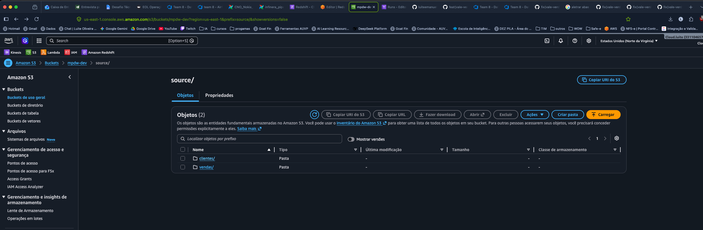
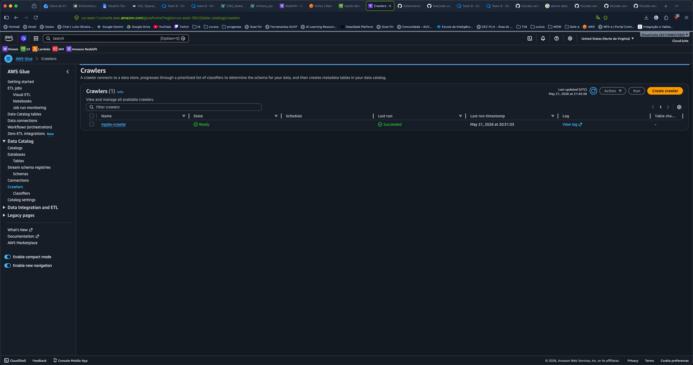
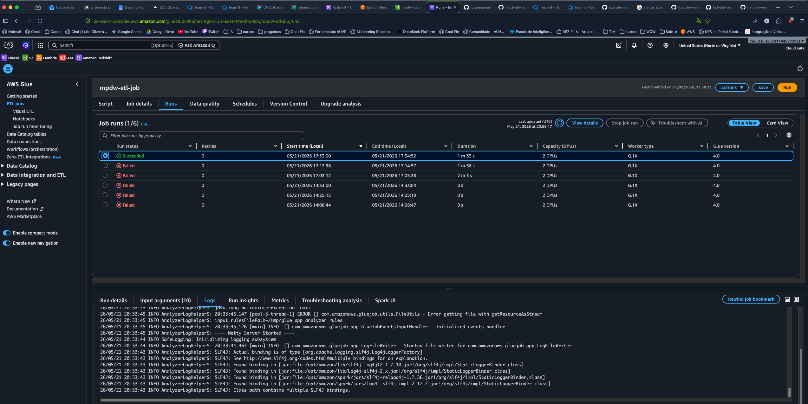
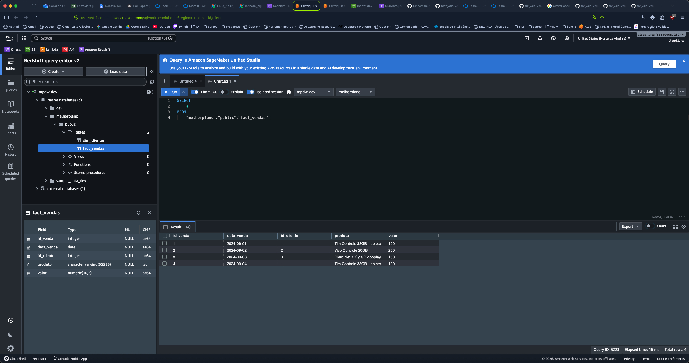

# Data Warehouse — MelhorPlano

Projeto de pipeline ETL para consolidar dados de vendas e clientes num Data Warehouse na AWS, modelado em star schema.

---

## O que faz

Pega dois arquivos CSV (clientes e vendas), transforma os dados com Python/Spark e carrega num banco Redshift organizado em tabela fato + tabela dimensão. Toda a infraestrutura sobe automaticamente via Terraform.

---

## Fluxo

```
CSV local → S3 → Glue Crawler → Glue ETL (PySpark) → Redshift
```

1. Terraform cria toda a infra na AWS (S3, Glue, Redshift)
2. CSVs sobem pro S3
3. Crawler cataloga os arquivos
4. ETL transforma e carrega no Redshift

---

## Infraestrutura provisionada

**S3 — bucket com os arquivos fonte e scripts**


**Glue Crawler — catalogando os CSVs**


**Glue ETL Job — executando a transformação**


**Redshift — tabelas carregadas no Data Warehouse**


---

## Star Schema

```
dim_clientes          fact_vendas
────────────          ───────────
id_cliente PK ◀──── id_cliente FK
nome                  id_venda PK
email                 data_venda
                      produto
                      valor
```

---

## Estrutura

```
DW-melhorplano/
├── data/
│   ├── vendas.csv
│   └── clientes.csv
├── glue/
│   └── etl_job.py          # Extract → Transform → Load
├── sql/
│   └── create_schema.sql   # DDL + queries de exemplo
├── terraform/
│   ├── main.tf
│   └── modules/
│       ├── s3/
│       ├── iam/
│       ├── redshift/
│       └── glue/
└── scripts/
    ├── upload_data.sh
    └── run_pipeline.sh
```

---

## Transformação dos dados (ETL)

O processo de transformação foi feito com **PySpark** rodando no AWS Glue.

### 1. Extração

Os dois arquivos CSV são lidos direto do S3 usando Spark:

```python
df_vendas   = spark.read.option("header", "true").option("inferSchema", "true").csv("s3://bucket/source/vendas/")
df_clientes = spark.read.option("header", "true").option("inferSchema", "true").csv("s3://bucket/source/clientes/")
```

O `inferSchema` detecta os tipos das colunas automaticamente.

### 2. Transformação — dimensão clientes

```python
dim_clientes = (
    df_clientes
    .select("id_cliente", "nome", "email")
    .dropDuplicates(["id_cliente"])
    .filter(F.col("id_cliente").isNotNull())
)
```

- Remove clientes duplicados pelo `id_cliente`
- Filtra linhas com `id_cliente` nulo

### 3. Transformação — fato vendas

```python
df_joined = df_vendas.join(dim_clientes.select("id_cliente"), on="id_cliente", how="inner")

fact_vendas = (
    df_joined
    .select(
        F.col("data").cast("date").alias("data_venda"),
        F.col("id_cliente"),
        F.col("produto"),
        F.col("valor").cast("decimal(10,2)"),
    )
    .filter(F.col("data_venda").isNotNull() & F.col("valor").isNotNull())
)

window = Window.orderBy("data_venda", "id_cliente")
fact_vendas = fact_vendas.withColumn("id_venda", F.row_number().over(window))
```

Passo a passo:
1. **Join com dim_clientes** — garante que só entram vendas com cliente válido (integridade referencial)
2. **Cast de tipos** — `data` vira `DATE`, `valor` vira `DECIMAL(10,2)`
3. **Filtro de nulos** — remove linhas sem data ou valor
4. **Geração do id_venda** — chave surrogate criada com `row_number()` ordenado por data, já que o CSV não tinha essa coluna

### 4. Carga no Redshift

Primeiro carrega `dim_clientes`, depois `fact_vendas` — respeitando a FK:

```python
carregar(dim_clientes, "dim_clientes")
carregar(fact_vendas, "fact_vendas")
```

A carga usa o conector JDBC do Glue com S3 como área de staging temporária (internamente o Redshift faz um `COPY` a partir do S3).

---

## Como rodar

**Pré-requisitos:** Terraform >= 1.5, AWS CLI configurado

```bash
# 1. Configure as variáveis
cp terraform/terraform.tfvars.example terraform/terraform.tfvars
# edite terraform.tfvars com sua senha do Redshift

# 2. Configure credenciais AWS
aws configure

# 3. Rode tudo
bash scripts/run_pipeline.sh
```

---

## Pontos de melhoria

O pipeline hoje roda manualmente via script. Algumas evoluções naturais:

- **Agendamento automático** — usar Amazon EventBridge para disparar o job Glue em horários definidos (ex: todo dia às 6h), sem precisar rodar o script na mão
- **Trigger por evento** — configurar o EventBridge para disparar o pipeline automaticamente quando novos arquivos chegarem no S3, tornando o processo orientado a eventos
- **Monitoramento** — adicionar alertas via SNS para notificar quando o job falhar
- **Remote state** — mover o `terraform.tfstate` para S3 + DynamoDB para trabalho em equipe
- **Testes de qualidade** — validar contagem de registros e nulos antes de carregar no Redshift

---

## Destruir infra

```bash
cd terraform && terraform destroy -auto-approve
```
